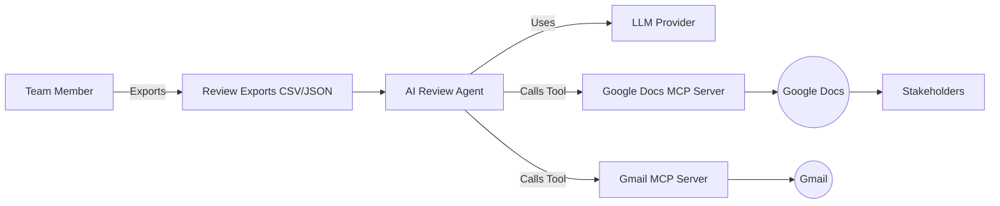
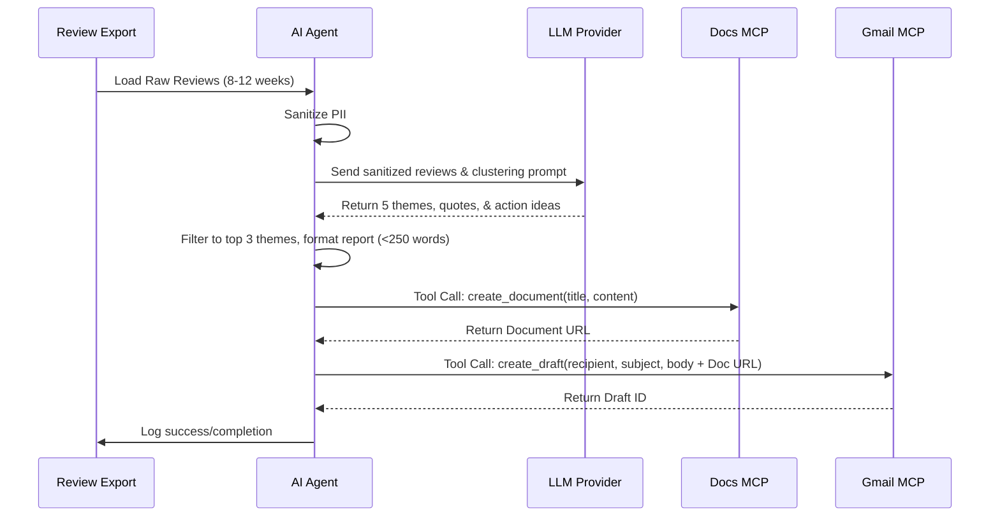

# System Architecture: AI-Powered Mobile Review Pulse

## 1. Architectural Overview
The system is built as a lightweight AI agent pipeline that ingests static review data, processes it via a Large Language Model (LLM) for thematic analysis, and utilizes the Model Context Protocol (MCP) to interact with external tools (Google Docs and Gmail). This architecture abstracts away external API complexities, focusing on data transformation and insight generation.

## 2. System Context

## 3. Core Components

### 3.1 Data Ingestion & Sanitization Module
* **Responsibilities:**
    * Parse raw public export files (e.g., CSV, JSON) from the App Store and Google Play Store.
    * Filter reviews by the targeted time window (last 8-12 weeks).
    * **Data Quality Filters:** Exclude reviews with fewer than 8 words, those containing emojis, or those not in English.
    * **Privacy Scrubber:** Remove PII (emails, names, phone numbers) before data is passed to the LLM.

### 3.2 AI Processing Engine (The Core Agent)
* **Responsibilities:**
    * **Prompt Engineering & Context:** Formulate prompts combining the sanitized reviews and instructions for clustering.
    * **Thematic Clustering:** Categorize reviews into up to 5 specific product themes (e.g., Onboarding, Payments, KYC).
    * **Distillation:** Select the top 3 most impactful themes.
    * **Extraction:** Pull 3 representative, verbatim user quotes.
    * **Ideation:** Generate 3 concrete, actionable next steps based on the findings.
    * **Formatting:** Assemble the insights into a scannable Markdown or plain text document (≤250 words).

### 3.3 MCP Integration Layer
* **Responsibilities:**
    * Interface with existing MCP servers rather than direct REST APIs.
    * **Google Docs Integration:** Transmit the formatted pulse document to the Google Docs MCP server to create or update the weekly document.
    * **Gmail Integration:** Transmit the pulse summary (or document link) to the Gmail MCP server to generate an email draft.

## 4. Sequence Diagram

## 5. Security & Constraints
* **Authentication:** Handled exclusively by the MCP server configurations. The AI Agent does not store or manage Google OAuth tokens.
* **PII Compliance:** Sanitization occurs *before* data is sent to external LLMs and *before* saving to Google Docs.
* **Rate Limiting & Robustness:** The agent must respect the token limits of the chosen LLM and the tool-call response times of the MCP servers.
